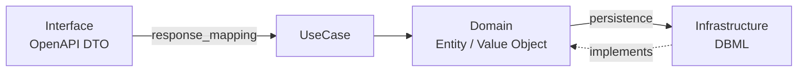

# USML — Usecase Markup Language

OpenAPI（インターフェース層）と DBML（DB定義）の間に **ドメイン層を第一級概念として導入** し、4層レイヤードアーキテクチャ（Interface → UseCase → Domain ← Infrastructure）の各境界のマッピング・変換を声明的に定義する言語です。

「APIレスポンスのフィールドが、どのドメインエンティティから来て、それがDBのどのテーブル・カラムにどう永続化されているか」を、3つの境界に分けて1つの YAML で管理できます。



> v0.2 は v0.1 からの破壊的変更です（ドメイン層の導入、`response_mapping` の `source` がドメイン語彙を指すよう変更）。詳細は [仕様書](docs/spec/usml-specification.md) を参照。

## Features

- **3境界の分離** — Domain⇄DB（`persistence`）/ Domain導出（`derived`）/ Domain⇄Interface（`response_mapping`）/ Interface表示変換（`presentation`）
- **ドメインモデル** — 値オブジェクト（VO）とエンティティを第一級で定義。関連（has_many / many_to_many 等）も表現
- **永続化マッピング** — JOIN・JOIN Chain・集約（COUNT/SUM/AVG/MIN/MAX）・エイリアスはすべて `persistence` に隔離
- **OpenAPI・DBML 参照インポート** — 外部スキーマファイルを直接参照して検証
- **3点照合バリデーション** — OpenAPI ⇄ Domain ⇄ DB の整合を16規則で検証
- **ddml トレース検証** — `import.ddml` で項目定義の正本（ddml）を参照し、実装が未確定の設計を使っていないか・設計と実装がずれていないかを 3 規則で検出（xmls ファミリー連携）
- **型整合検証** — VO型を軸に OpenAPI の type/format・DBカラム型を突き合わせ（不一致は警告）
- **インタラクティブ可視化** — 4カラムのデータフロー図（Response → Domain → Persistence → Tables）とテーブルビュー
- **VS Code拡張** — 保存時の自動バリデーション・データフロー図プレビュー

## Installation

```sh
# Rust を事前にインストールが必要
git clone https://github.com/Nenene01/usml.git
cd usml
cargo build --release
# バイナリ: target/release/usml
```

## Usage

### バリデーション

```sh
usml validate examples/users-list.usml.yaml
```

JSON 形式で出力（CI・拡張連携用）:

```sh
usml validate --json examples/users-list.usml.yaml
```

`validate` は `import` で参照する OpenAPI/DBML ファイルを解決し、フィールド・カラム存在確認に加えて型整合まで検証します。

### AST 確認

```sh
usml parse examples/users-list.usml.yaml
```

ドメインエンティティ・VO・レスポンスマッピングの構造を表示します。

### データフロー図生成

```sh
# デフォルト: ./output/<usecase-name>.html に出力
usml visualize examples/users-list.usml.yaml

# カスタムパスに出力 (-o または --output)
usml visualize examples/users-list.usml.yaml -o custom.html
```

**出力先の優先順位:**
1. `-o/--output` オプション（最優先）
2. USMLファイル内の `usecase.output` パラメータ
3. デフォルト: `./output/<usecase.name>.html`

**生成されるHTML の機能:**
- **タブ切り替え**: テーブルビュー ⇄ ビジュアルビュー
- **OpenAPI情報**: ヘッダーにHTTPメソッド・APIパス・ステータスコードを表示
- **ビジュアルビュー（4カラム）**: Response Fields → Domain Entities → Persistence → Tables のデータフロー
  - ホバーで `Response → Domain → Persistence → Table` の対応経路を双方向ハイライト
- **テーブルビュー**: Response Mapping / Domain Entities / Persistence Mapping / Derived / Presentation / Filters

## USML 構文（v0.2）

```yaml
version: "0.2"

import:
  openapi: ./api.yaml#paths["/users"].get.responses["200"]
  dbml:
    - ./schema.dbml#tables["users"]
    - ./schema.dbml#tables["profiles"]

domain:
  value_objects:
    - { name: UserId, base: integer }
    - { name: Url, base: string, format: uri }
    - { name: Email, base: string, format: email }
  entities:
    User:
      fields:
        id: UserId
        name: string
        email: Email
        avatarUrl: Url
        displayName: string
      # Domain ⇄ Infrastructure（永続化マッピング。JOIN/集約はここ）
      persistence:
        root_table: users
        columns:
          id: users.id
          name: users.name
          email: users.email
          avatarUrl:
            source: profiles.avatar_url
            join: { table: profiles, on: users.id = profiles.user_id }
          displayName:
            source: profiles.display_name
            join: { table: profiles, on: users.id = profiles.user_id }
      # Domain 内の導出ロジック
      derived:
        - field: displayName
          type: COALESCE
          sources: [profiles.display_name, users.name]
          fallback: "anonymous"

usecase:
  name: ユーザー一覧取得
  summary: ページネーション付きのユーザー一覧を返す
  root: User

  # Domain ⇄ Interface（source はドメイン語彙。DBカラム直接参照は禁止）
  response_mapping:
    - { field: id, source: User.id }
    - { field: avatar_url, source: User.avatarUrl }
    - { field: display_name, source: User.displayName }

  filters:
    - { param: status, maps_to: WHERE, condition: "User.status = :status" }
    - { param: page, maps_to: PAGINATION, strategy: offset, page_size: 20 }

  # Interface の表示変換
  presentation:
    - target: email
      type: MASK
      mask_pattern: "***@***.***"
      condition:
        - { param: viewer_role, operator: "!=", value: "admin" }
```

配列フィールド・多対多・集約を含む例は `examples/posts-detail.usml.yaml` を参照。

### ddml トレース（xmls ファミリー連携）

`import.ddml` に項目定義の正本（`.ddml.yaml`）を並べると、persistence が参照する DB 列と
ddml 項目の `storage.status` を照合します（`import.ddml` 省略時は従来動作のまま）。

```yaml
import:
  dbml:
    - ./order-schema.dbml#tables["orders"]
  ddml:                       # fragment 不要の素のパス（1ファイル=1業務）
    - ./order.ddml.yaml
```

| 規則 | 種別 | 内容 |
|---|---|---|
| `ddml.trace.status` | error | 参照列に対応する ddml 項目の `storage` が `confirmed` でない（未確定の設計を実装に使用） |
| `ddml.trace.column` | warning | 参照列が ddml のどの項目の `schema` にも無い（設計定義に無い列を使用） |
| `ddml.coverage` | warning | `confirmed` かつ `schema` 付きの ddml 項目が persistence から未参照（実装マッピング漏れの可能性） |

最小の実例は `examples/orders-list.usml.yaml`（+ `order.ddml.yaml` / `order-schema.dbml`）を参照。
上流 ddml の `storage.status` を `hypothesis` に落とすと `ddml.trace.status` エラーが再現できます。

## VS Code 拡張

`extensions/vscode/` ディレクトリに拡張のソースがあります。

- `.usml.yaml` ファイルの保存時に自動バリデーション
- `USML: データフロー図を開く` コマンドでWebviewプレビュー
- `usml.binaryPath` 設定でバイナリパス指定可能

## Project Structure

```
usml/
├── cli/src/main.rs          # CLI エントリポイント (validate/parse/visualize)
├── core/src/
│   ├── ast.rs               # AST 型定義（domain / usecase）
│   ├── parser.rs            # YAML → AST パーサー
│   ├── validator.rs         # 16規則バリデーション（3点照合 + 型整合）+ ddml トレース検証
│   ├── visualizer.rs        # 4カラムのインタラクティブHTMLデータフロー図生成
│   └── resolver/
│       ├── dbml.rs          # DBML 解析（カラム型抽出）
│       ├── ddml.rs          # ddml 解析（項目 / storage.schema 抽出）
│       └── openapi.rs       # OpenAPI 解析（type/format 抽出）
├── extensions/vscode/       # VS Code 拡張
├── examples/                # サンプル USML / OpenAPI / DBML / ddml
├── output/                  # 生成されたHTMLファイル（デフォルト出力先）
└── docs/spec/               # USML 仕様ドキュメント
```

## License

MIT
