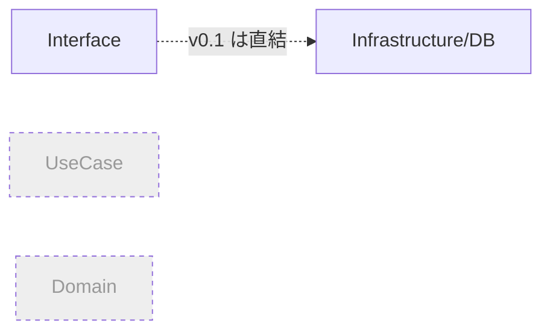
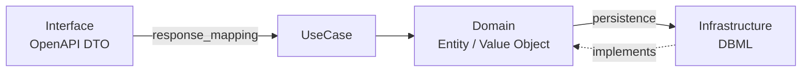

# USML Specification v0.2

> **Usecase Markup Language** — OpenAPI（インターフェース層）と DBML（DB定義）の間に **ドメイン層を第一級概念として導入** し、4層レイヤードアーキテクチャの各境界のマッピング・変換を声明的に定義する言語。

**ステータス:** 正式版（v0.2）。本ドキュメントは v0.1 からの**破壊的変更**を含む（後方互換なし）。v0.1 の仕様内容は git 履歴を参照。

---

## 1. v0.1 の問題と v0.2 の狙い

### 1.1 v0.1 の構造的問題

v0.1 の `response_mapping` は、APIレスポンスフィールドを **DBテーブル.カラムへ直結**していた。

```yaml
# v0.1
- field: avatar_url          # Interface 層 (OpenAPI DTO)
  source: profiles.avatar_url  # Infrastructure 層 (DBカラム)
```

これは図に当てはめると、Interface と Infrastructure を直結し、**UseCase 層と Domain 層が言語上に存在しない**状態だった。名前は "Usecase ML" だが、実態は「Interface ⇄ DB の宣言的マッピング言語」であり、インフラの都合（テーブル分割・JOIN）がそのまま API フィールドへ漏れていた。



### 1.2 v0.2 の設計原則 — 3つの境界を分ける

v0.2 は、1本に圧縮されていたマッピングを **3つの境界**に開く。依存の向きは常に Domain へ向かう。



| 境界 | USML セクション | 関心事 |
|---|---|---|
| Domain ⇄ Infrastructure | `domain.entities[].persistence` | テーブル分割の吸収・JOIN・集約（インフラ関心） |
| Domain 内の導出 | `domain.entities[].derived` | ドメインロジック（デフォルト値・可視性ルール） |
| Domain ⇄ Interface | `usecase.response_mapping` | ドメイン語彙 → DTO の射影 |
| Interface の表示変換 | `usecase.presentation` | 表示ラベル・閲覧者文脈のマスキング |

**v0.2 の核心ルール:** `usecase.response_mapping[].source` は **DBカラムを直接参照できない**。必ず**ドメイン語彙**（`User.avatarUrl` のような `Entity.field`）を指す。DBカラムへの対応は `domain` セクションが一手に引き受ける。

---

## 2. ファイル構造

```yaml
version: "0.2"

import:
  openapi: <パス>#<参照先>
  dbml:
    - <パス>#tables["<テーブル名>"]
  ddml:                              # v0.2.1 で新設（任意）。項目定義の正本を参照
    - <パス>                          # fragment 不要の素のパス（1ファイル=1業務）

# v0.2 で新設（必須）
domain:
  value_objects:
    - <VO定義>
  entities:
    <エンティティ名>:
      <ドメイン定義 + persistence + derived>

usecase:
  name: <ユースケース名>
  summary: <説明>
  output: <出力ファイル名>          # オプション
  root: <ルートエンティティ名>       # v0.2 で新設

  response_mapping:                # Domain ⇄ Interface（source はドメイン語彙）
    - <マッピング定義>

  filters:
    - <フィルタ定義>

  presentation:                    # v0.2 で新設（旧 transforms の表示系）
    - <表示変換定義>
```

`domain` セクションは v0.2 では**必須**。`response_mapping.source` がドメイン語彙を指すため、その語彙を定義する `domain` がないと検証できない。

---

## 3. domain セクション

ドメインモデル（エンティティと値オブジェクト）を定義し、各フィールドの**永続化マッピング**と**導出ロジック**を持つ。

### 3.1 value_objects（値オブジェクト）

ドメインの型を宣言する。OpenAPI のスキーマ型・DBカラム型との**3点整合検証**（§7.2）の基礎になる。

```yaml
domain:
  value_objects:
    - name: UserId
      base: integer
    - name: Url
      base: string
      format: uri
    - name: Email
      base: string
      format: email
```

- `name`: VO 名（エンティティのフィールド型として参照される）
- `base`: 基底型（`string` / `integer` / `number` / `boolean` / `datetime`）
- `format`: オプションの意味的フォーマット（OpenAPI の `format` と照合可能）

### 3.2 entities（エンティティ）

```yaml
domain:
  entities:
    User:
      fields:
        id: UserId
        name: string
        email: Email
        avatarUrl: Url
        displayName: string

      # Domain ⇄ Infrastructure（永続化マッピング）
      persistence:
        root_table: users          # このエンティティの基点テーブル
        columns:
          id: users.id
          name: users.name
          email: users.email
          avatarUrl:
            source: profiles.avatar_url
            join:
              table: profiles
              on: users.id = profiles.user_id
              type: LEFT JOIN
          displayName:
            source: profiles.display_name
            join:
              table: profiles
              on: users.id = profiles.user_id

      # Domain 内の導出ロジック（ドメインの語彙だけで完結）
      derived:
        - field: displayName
          type: COALESCE
          sources:
            - profiles.display_name
            - users.name
          fallback: "anonymous"
```

#### 3.2.1 fields

`<フィールド名>: <型>`。型は組み込み型か `value_objects` で定義した VO 名。

#### 3.2.2 persistence — Domain ⇄ DB

- `root_table`: エンティティの基点テーブル。`join` の左辺のデフォルトになる
- `columns.<field>`: フィールドの永続化先
  - 単純対応: `users.name`（文字列）
  - 結合あり: `source` + `join`（v0.1 の `join` と同じ表現力。`alias`・`type` 対応）
  - 多段結合: `join` + `join_chain`（v0.1 §4.5 と同じ）
  - 集約: `source` + `join` + `aggregate`（v0.1 §4.3 と同じ。1対多の `COUNT`/`SUM` 等）

**v0.1 の JOIN・集約・join_chain・alias はすべて persistence 配下へ移動する。** これらはインフラ関心（テーブルがどう分割・正規化されているか）であり、ドメインやインターフェースが知るべきことではない。

#### 3.2.3 derived — ドメイン導出

**ドメインの語彙だけで完結する**値の導出を定義する。v0.1 transforms のうち、ドメインロジックに属するものをここへ置く。

| 種別 | 用途 | 例 |
|---|---|---|
| `COALESCE` | デフォルト値・フォールバック | `displayName = display_name ?? name ?? "anonymous"` |
| `CONDITIONAL_SOURCE` | 可視性のドメインルール | 下書きなら本文の代わりにプレビューを返す |
| `CONCAT` | 値の合成 | `fullName = firstName + " " + lastName` |

```yaml
derived:
  - field: bodyContent
    type: CONDITIONAL_SOURCE
    when:
      - source: posts.status
        operator: "=="
        value: "draft"
    then_source: posts.preview_text
    else_source: posts.body
```

判定基準: **閲覧者（リクエスト文脈）や表示形式に依存しないなら derived（ドメイン）**。依存するなら presentation（§5.3）。

### 3.3 エンティティ間の関連

1対多・多対多の関連は、子エンティティを別エンティティとして定義し、`relations` で結ぶ。

```yaml
domain:
  entities:
    Post:
      fields:
        id: PostId
        title: string
        likeCount: integer
      persistence:
        root_table: posts
        columns:
          id: posts.id
          title: posts.title
          likeCount:
            source: likes.id
            join:
              table: likes
              on: posts.id = likes.post_id
            aggregate:
              type: COUNT
              group_by: posts.id
      relations:
        comments:
          target: Comment
          kind: has_many
          on: posts.id = comments.post_id
        tags:
          target: Tag
          kind: many_to_many
          through:
            table: post_tags
            on: posts.id = post_tags.post_id
          on: post_tags.tag_id = tags.id

    Comment:
      fields:
        id: CommentId
        body: string
        authorName: string
        createdAt: datetime
      persistence:
        root_table: comments
        columns:
          id: comments.id
          body: comments.body
          authorName:
            source: comment_author.name
            join:
              table: users
              alias: comment_author
              on: comments.user_id = users.id
          createdAt: comments.created_at
```

- `kind`: `has_many` / `has_one` / `belongs_to` / `many_to_many`
- `through`: 多対多の中間テーブル（v0.1 の `join_chain` 相当をドメイン関連として表現）

---

## 4. usecase.response_mapping — Domain ⇄ Interface

APIレスポンスの各フィールドが、**どのドメインフィールド**から来るかを定義する。`source` は必ずドメイン語彙。

```yaml
usecase:
  root: User             # ルートエンティティ
  response_mapping:
    - field: id
      source: User.id
    - field: avatar_url
      source: User.avatarUrl
    - field: display_name
      source: User.displayName
```

- `source: <Entity>.<field>` 形式。`<field>` は `domain.entities[].fields` に存在する必要がある（§7 規則）
- JOIN・集約・transform は **書かない**（すべて domain 側が解決済み）。response_mapping は純粋な「ドメイン → DTO」の射影に徹する

### 4.1 配列フィールド（関連の展開）

```yaml
response_mapping:
  - field: comments
    type: array
    source: Post.comments        # relations の名前を指す
    fields:
      - field: id
        source: Comment.id
      - field: body
        source: Comment.body
      - field: author_name
        source: Comment.authorName
      - field: created_at
        source: Comment.createdAt
  - field: tags
    type: array
    source: Post.tags
    fields:
      - field: id
        source: Tag.id
      - field: name
        source: Tag.name
```

- `source` が `relations` を指すとき、`fields` はその関連先エンティティの射影
- v0.1 の `source_table` / `join` / `join_chain`（配列定義内のインフラ詳細）は不要になる

---

## 5. filters / presentation

### 5.1 filters

v0.1 と同じ（WHERE / PAGINATION / ORDER_BY）。ただし `condition`・`default_column`・`allowed_columns` 等で参照する対象は、**ドメイン語彙**を推奨する（例: `User.status = :status`）。USML がドメイン → DB 解決を行うため、DBカラム名を直接書く必要がなくなる。

```yaml
filters:
  - param: status
    maps_to: WHERE
    condition: User.status = :status
  - param: page
    maps_to: PAGINATION
    strategy: offset
    page_size: 20
  - param: sort
    maps_to: ORDER_BY
    default_column: User.createdAt
    default_direction: DESC
    allowed_columns: [User.createdAt, User.name, User.id]
```

### 5.2 presentation — Interface の表示変換

旧 `transforms` のうち、**閲覧者文脈や表示形式に依存する**ものをここへ置く。`target` はレスポンスフィールド名（response_mapping の field）。

```yaml
presentation:
  - target: email
    type: MASK
    mask_pattern: "***@***.***"
    condition:                  # 適用条件（param/operator/value、複数列記で AND）
      - param: viewer_role
        operator: "!="
        value: "admin"
  - target: status_label
    type: CASE
    source: User.status
    when:                       # CASE の分岐（value/then）
      - value: "active"
        then: "アクティブ"
      - value: "suspended"
        then: "停止中"
    else: "不明"
```

| 種別 | 帰属の理由 |
|---|---|
| `MASK` (viewer_role 条件) | 閲覧者の権限に依存する表示制御 |
| `CASE` (表示ラベル) | 表示用の言語・文言。ドメインの状態は変えない |

> **キーの使い分け**: `presentation` では CASE の分岐を `when:`（`value`/`then`）で、変換の適用条件を `condition:`（`param`/`operator`/`value`）で表す。両者はキーが異なる。

### 5.3 transform 振り分け早見表

| v0.1 transform | v0.2 の置き場所 | 理由 |
|---|---|---|
| `COALESCE` | `domain.derived` | 値の導出はドメインの責務 |
| `CONCAT` | `domain.derived` | 同上 |
| `CONDITIONAL_SOURCE` | `domain.derived` | 可視性のドメインルール |
| `MASK`（viewer 条件） | `usecase.presentation` | 閲覧者文脈の表示制御 |
| `CASE`（表示ラベル） | `usecase.presentation` | 表示用文言 |

---

## 6. 完全なサンプル（v0.2）

### 6.1 ユーザー一覧取得

```yaml
version: "0.2"

import:
  openapi: ./api.yaml#paths["/users"].get.responses["200"]
  dbml:
    - ./schema.dbml#tables["users"]
    - ./schema.dbml#tables["profiles"]

domain:
  value_objects:
    - { name: UserId, base: integer }
    - { name: Url, base: string, format: uri }
    - { name: Email, base: string, format: email }
  entities:
    User:
      fields:
        id: UserId
        name: string
        email: Email
        avatarUrl: Url
        displayName: string
        status: string
        createdAt: datetime
      persistence:
        root_table: users
        columns:
          id: users.id
          name: users.name
          email: users.email
          status: users.status
          createdAt: users.created_at
          avatarUrl:
            source: profiles.avatar_url
            join: { table: profiles, on: users.id = profiles.user_id }
          displayName:
            source: profiles.display_name
            join: { table: profiles, on: users.id = profiles.user_id }
      derived:
        - field: displayName
          type: COALESCE
          sources: [profiles.display_name, users.name]
          fallback: "anonymous"

usecase:
  name: ユーザー一覧取得
  summary: ページネーション付きのユーザー一覧を返す
  root: User
  response_mapping:
    - { field: id, source: User.id }
    - { field: name, source: User.name }
    - { field: email, source: User.email }
    - { field: avatar_url, source: User.avatarUrl }
    - { field: display_name, source: User.displayName }
  filters:
    - { param: status, maps_to: WHERE, condition: "User.status = :status" }
    - { param: page, maps_to: PAGINATION, strategy: offset, page_size: 20 }
  presentation:
    - target: email
      type: MASK
      mask_pattern: "***@***.***"
      when:
        - { param: viewer_role, operator: "!=", value: "admin" }
```

### 6.2 投稿詳細取得（関連・集約・多対多を含む）

```yaml
version: "0.2"

import:
  openapi: ./api.yaml#paths["/posts/{post_id}"].get.responses["200"]
  dbml:
    - ./schema.dbml#tables["posts"]
    - ./schema.dbml#tables["users"]
    - ./schema.dbml#tables["comments"]
    - ./schema.dbml#tables["likes"]
    - ./schema.dbml#tables["tags"]
    - ./schema.dbml#tables["post_tags"]

domain:
  value_objects:
    - { name: PostId, base: integer }
    - { name: CommentId, base: integer }
    - { name: TagId, base: integer }
  entities:
    Post:
      fields:
        id: PostId
        title: string
        body: string
        bodyContent: string
        authorName: string
        likeCount: integer
        status: string
      persistence:
        root_table: posts
        columns:
          id: posts.id
          title: posts.title
          body: posts.body
          status: posts.status
          authorName:
            source: users.name
            join: { table: users, on: posts.user_id = users.id }
          likeCount:
            source: likes.id
            join: { table: likes, on: posts.id = likes.post_id }
            aggregate: { type: COUNT, group_by: posts.id }
      derived:
        - field: bodyContent
          type: CONDITIONAL_SOURCE
          when:
            - { source: posts.status, operator: "==", value: "draft" }
          then_source: posts.preview_text
          else_source: posts.body
      relations:
        comments:
          target: Comment
          kind: has_many
          on: posts.id = comments.post_id
        tags:
          target: Tag
          kind: many_to_many
          through: { table: post_tags, on: "posts.id = post_tags.post_id" }
          on: post_tags.tag_id = tags.id
    Comment:
      fields:
        id: CommentId
        body: string
        authorName: string
        createdAt: datetime
      persistence:
        root_table: comments
        columns:
          id: comments.id
          body: comments.body
          createdAt: comments.created_at
          authorName:
            source: comment_author.name
            join: { table: users, alias: comment_author, on: comments.user_id = users.id }
    Tag:
      fields:
        id: TagId
        name: string
      persistence:
        root_table: tags
        columns:
          id: tags.id
          name: tags.name

usecase:
  name: 投稿詳細取得
  summary: 投稿本文・著者・コメント・いいねCount・タグを返す
  root: Post
  response_mapping:
    - { field: id, source: Post.id }
    - { field: title, source: Post.title }
    - { field: body, source: Post.bodyContent }   # 派生フィールドを射影
    - { field: author_name, source: Post.authorName }
    - { field: like_count, source: Post.likeCount }
    - field: tags
      type: array
      source: Post.tags
      fields:
        - { field: id, source: Tag.id }
        - { field: name, source: Tag.name }
    - field: comments
      type: array
      source: Post.comments
      fields:
        - { field: id, source: Comment.id }
        - { field: body, source: Comment.body }
        - { field: author_name, source: Comment.authorName }
        - { field: created_at, source: Comment.createdAt }
  filters:
    - { param: post_id, maps_to: WHERE, condition: "Post.id = :post_id" }
```

---

## 7. バリデーション規則（v0.2）

v0.2 では検証が **OpenAPI ⇄ Domain ⇄ DB の3点照合**になる。

### 7.1 構造規則

1. `domain.entities` が1つ以上定義され、`usecase.root` が存在するエンティティを指すこと
2. `response_mapping[].source` が `<Entity>.<field>` 形式で、その Entity・field が `domain` に存在すること（**DBカラム直接参照は禁止**）
3. `response_mapping[].field` が `import.openapi` のレスポンススキーマのフィールドと一致すること
4. 配列フィールドの `source` が `relations` を指し、`fields` が関連先エンティティのフィールドを射影していること
5. `persistence.columns[].source`・`join`・`join_chain`・`aggregate` が参照するテーブル・カラムが `import.dbml` に存在すること（v0.1 規則 2/3/6 を persistence へ移設）
6. 同一テーブルを異なる結合条件で複数回参照する場合、`alias` 必須（v0.1 規則 7）
7. `aggregate` 使用フィールドに `group_by` が明示されるか、`root_table` の主キーが推定可能であること（v0.1 規則 8）
8. `relations[].through` / `on` が参照するテーブル・カラムが `import.dbml` に存在すること
9. `derived[].field` が当該エンティティの `fields` に存在すること
10. `presentation[].target` が `response_mapping[].field` のいずれかに対応すること（v0.1 規則 5）
11. `filters[].param` が `import.openapi` のパラメータに存在し、`condition` 内の `:param` がすべて宣言済みであること（v0.1 規則 4/9）
12. `presentation[].when[].param` が `import.openapi` に存在すること（v0.1 規則 10）
13. `allowed_columns` 外のカラムが動的ソート指定で使われていないこと（v0.1 規則 12）

### 7.2 型整合規則（v0.2 新規）

ドメイン VO 型を軸に、両端の型を検証する。

14. エンティティ fields の型が組み込み型または `value_objects` に存在すること
15. **OpenAPI ⇄ Domain**: `response_mapping` で対応する OpenAPI フィールドの型/format が、ドメインフィールドの VO の `base`/`format` と整合すること（不一致は warning）
16. **Domain ⇄ DB**: `persistence.columns` で対応する DBカラム型が、ドメインフィールドの VO の `base` と整合すること（不一致は warning）

> 型整合は当面 **warning** とし、段階的に error へ引き上げる。

### 7.3 ddml トレース規則（v0.2.1 新規）

`import.ddml` で項目定義の正本（`.ddml.yaml`）を参照した場合のみ実行する。
`import.ddml` を省略すると 3 規則とも一切発動せず、従来動作と完全に互換。

`.ddml.yaml` は usml 内の最小 serde 構造体で読み（ddml クレートには依存しない・未知フィールドは無視）、
各項目の `{ item_id, item_name, storage_status, schema:(table, column) }` を抽出する。
`storage.status` 省略時は `hypothesis` 扱い。照合対象の列集合は規則 5 の `source` と同一
（`ColumnMapping::Simple` の `table.column`・`Detailed.source`。`join.alias` は実テーブルへ解決）。

17. **`ddml.trace.status`**（error）: persistence が参照する列に対応する ddml 項目が存在するが、その `storage` が `confirmed` でないこと ＝ 未確定の設計項目を実装マッピングに使用している
18. **`ddml.trace.column`**（warning）: persistence が参照する列が、ddml のどの項目の `schema` にも定義されていないこと ＝ 設計定義に無い列を使用している
19. **`ddml.coverage`**（warning）: `confirmed` かつ `schema` 付きの ddml 項目が、この usml の persistence でどこからも参照されていないこと ＝ 実装マッピング漏れの可能性

> ddml → usml のトレースにより「未確定の設計を実装に持ち込んでいないか」「設計と実装がずれていないか」を検出する。
> 上流の ddml で `storage.status` を `confirmed` に上げることで規則 17 のエラーが解消される。

---

## 8. 視覚化（v0.2）

3カラム（Response / Joins / Tables）から **4カラム**へ拡張し、ドメイン層を中央に据える。

```
[ Response Fields ] → [ Domain Entities ] → [ Persistence (Join/Aggregate) ] → [ Tables ]
```

- **Response Fields**: API レスポンスのフィールド（presentation 変換はバッジ表示）
- **Domain Entities**: エンティティ・フィールド・VO 型・derived 導出を表示
- **Persistence**: 各ドメインフィールドの JOIN・集約・alias
- **Tables**: 使用テーブル・カラム

ホバーで `Response → Domain → Persistence → Table` の対応経路をハイライトする。

---

## 9. 移行ガイド（v0.1 → v0.2）

v0.2 は破壊的変更。既存 `.usml.yaml` は次の手順で移行する。

1. `version` を `"0.2"` に更新
2. `domain.entities.<E>` を新設し、`root_table` を旧ルートテーブルに設定
3. 旧 `response_mapping[].source`（DBカラム）を `persistence.columns` へ移す。`join`/`join_chain`/`aggregate`/`alias` もここへ移設
4. 配列の `join`/`source_table` を `relations` へ変換
5. 旧 `transforms` を §5.3 早見表に従い `domain.derived` と `usecase.presentation` へ振り分け
6. `response_mapping[].source` をドメイン語彙 `<Entity>.<field>` に書き換え
7. （任意）`value_objects` を定義し型整合検証を有効化

> 将来的に `usml migrate <v0.1ファイル>` で 1〜6 を自動推論するコマンドを検討（本ドラフトのスコープ外）。

---

## 10. 実装ロードマップ

| 段階 | 内容 | 対象 |
|---|---|---|
| 1 | AST 拡張: `Domain` / `Entity` / `Persistence` / `Relation` / `ValueObject` 型、`Usecase.presentation`・`root` | `core/src/ast.rs` |
| 2 | パーサー: domain セクション・ドメイン語彙 `source` の解析 | `core/src/parser.rs` |
| 3 | バリデーター: 規則 1〜13 を3点照合に再編、persistence へ JOIN/集約検証を移設 | `core/src/validator.rs` |
| 4 | 型整合検証（規則 14〜16、warning） | `core/src/validator.rs` + resolver |
| 5 | examples を v0.2 へ書き換え（§6） | `examples/` |
| 6 | visualizer 4カラム化 | `core/src/visualizer.rs` |
| 7 | v0.2 仕様を正式版へ昇格、README 更新 | `docs/spec/` `README.md` |

---

## 11. 今後の拡張候補（v0.3 以降）

- `usml migrate` 自動移行コマンド
- ミューテーション定義（INSERT / UPDATE / DELETE のデータフロー）
- リポジトリ層の明示（複数データソース・外部API をドメインへ再構成）
- 複数ユースケースの合成（1レスポンスを複数ユースケースから組み立てる）
- 認証コンテキスト（`auth_context` によるデータフィルタの第一級化）
- Union / Discriminator 型分岐
